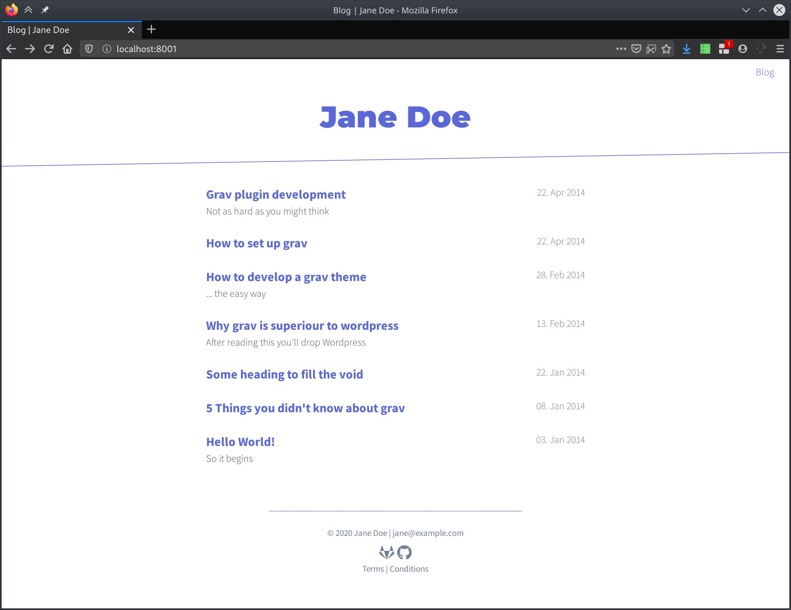

# Prizayu for Grav



based by grav theme [Tail](https://github.com/getgrav/grav-theme-tail)

## Features

* Multipurpose for small traffic site
* Made with [Tailwindcss](https://tailwindcss.com/) X [DaisyUI](https://daisyui.com)
* Fully responsive
* Multiple page template types
* Matomo-Support

## Supported Page Templates

* Default view template `default.md`
* Error view template `error.md`
* Blog view template `post-list.md`
* Blog item view template `post.md`

There are templates for products. Product are currently a work in progress:
* Product view template `prods-list.md`
* Product item view template `prods.md`

## Supported Plugins

The following plugins have custom styling by this theme:

* [Markdown-Notices](https://github.com/getgrav/grav-plugin-markdown-notices)
* [Pagination](https://github.com/getgrav/grav-plugin-pagination)
* [Langswitcher](https://github.com/getgrav/grav-plugin-langswitcher)

See the [Optional Plugins](#optional-plugins) section for details and sample config snippets.

# Installation

Installing the Prizayu theme can be done in manual way. Because this theme is still work in progress. So we will not distribute it yet. But feel free to fork this!

## Manual Installation

To install this theme, just download the zip version of this repository and unzip it under `/your/site/grav/user/themes`. Then, rename the folder to `prizayu`. You can find these files either on [GitHub](https://github.com/rizqijune/prizayu).

You should now have all the theme files under

    /your/site/grav/user/themes/prizayu

# Site options

## Footer
The footer links can be adapted in your `site.yaml` like this:

    footer:
      links:
        - text: Terms
          url: '/datenschutz'
        - text: Conditions
          url: '/impressum'
      social:
        - icon: gitlab
          url: https://gitlab.com/marcelkr
        - icon: github
          url: https://gitlab.com/marcelkr

To use the social links with icons install [
grav-plugin-embed-fontawesome](https://github.com/N-Parsons/grav-plugin-embed-fontawesome) and follow the steps to set up the SVG files needed. 

> Will be removed completely in the future.

## Matomo
Matomo is also configured via `site.yaml`. This is how a sample configuration:

    matomo:
        enabled: true
        matomo_url: matomo.mysite.de
        site_id: 1

Once enabled, the partial `partials/matomo.html.twig` is included in the base template.
`matomo_url` denotes the matomo URL. `site_id` configures the site ID used in Matomo.
If you have several sites configured it might be != 1.

> Will be using easiest way for user to configurate it in the future.

# Style customizing
Most of the style can be customized by adapting the `class` attributes in the templates. This is the idea of tailwindcss's [Utility-First Approach](https://tailwindcss.com/docs/utility-first).

**Important**: The final css file is cleaned up with `postcss-purgecss` and minified by `cssnano`. Meaning: `postcss-purgecss` looks through your twig template files, recognizes which classes you used and then deletes all unused CSS from the final stylesheet. Then the sylesheet is minified using `cssnano`.

In case you're trying to add classes to the templates and nothing changes, it is possible that these classes aren't used anywhere else and therefore not present in the cleaned `main.css`.


# Optional Plugins

## Markdown-Notices

The [Markdown-Notices](https://github.com/getgrav/grav-plugin-markdown-notices) Plugin is supported 
and has custom styling. I suggest the following custom configuration for the plugin:

```
enabled: true
built_in_css: false
level_classes: [indigo, green, yellow, red]
```

Note `level_classes` being reordered and `blue` being replaced by `indigo`.

## Pagination

[Pagination](https://github.com/getgrav/grav-plugin-pagination) works out of the box and needs no further configuration.

## Langswitcher

The language switching template is included in the navbar as soon as the plugin
[Langswitcher](https://github.com/getgrav/grav-plugin-langswitcher)
is enabled and more than one language is available in the `languages.supported` 
array in the `system.yaml` config file.

For the exact behaviour and tweaking see `partials/langswitcher.html.twig`
